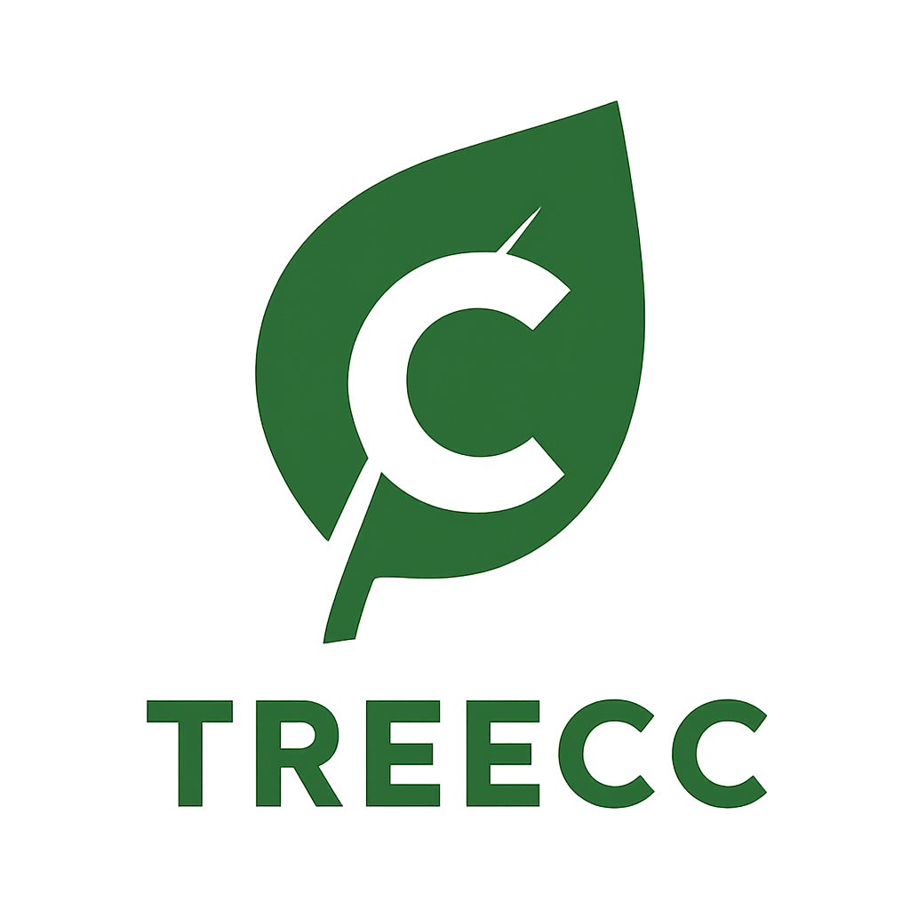

# Tree C Compiler

## Description
The Tree C Compiler (TreeCC), is an AST-less Sea of Nodes compiler (SoN).
Much like TinyCC we do not create an Abstract Syntax Tree (AST) when parsing.
However, unlike TinyCC we first lower to an Sea of Nodes intermediate-
representation (IR) and perform optimizations on it. **WARNING!** this is not even
remotely complete project, a similar project like Cuik is much better for most
people. TreeCC is kind of a ironic name as their is no AST. I started on a
C compiler years ago (did not finish) and that was the name I chose. It kinda stuck 
with me